# Homelab

A two-node virtualized enterprise lab built to simulate a small corporate IT environment for hands-on security and compliance skill development. Designed around the control domains relevant to IT audit, GRC, and security compliance work — identity and access management, security monitoring, vulnerability management, and network security.

---

## Overview

This lab simulates the kind of environment a GRC analyst or IT auditor would be assessing — a domain-joined Windows environment, centralized log collection and alerting, vulnerability scanning, DNS filtering, and remote access infrastructure. Every component was selected and configured to mirror real enterprise patterns, not just to learn the tools in isolation.

Built and operated by a U.S. Coast Guard veteran transitioning into GRC and security compliance, with a background in federal regulatory enforcement, compliance inspections, and operational risk assessment.

---

## Network Diagram

---

## Infrastructure

### Physical Hardware

| Device | Role | IP |
|---|---|---|
| Lenovo ThinkCentre M920q (pve1) | Proxmox Node 1 | 192.168.0.20 |
| Lenovo ThinkCentre M920q (pve2) | Proxmox Node 2 | 192.168.0.21 |
| Synology NAS | Backup and file storage | 192.168.0.30 |
| TP-Link ER605 | Router / gateway | 192.168.0.1 |
| TP-Link SG2008P | Managed PoE switch | — |
| GL.iNet Beryl AX | WiFi bridge | — |
| CyberPower UPS | Power protection | — |
| TecMojo 6U 10" Mini Rack | Rack enclosure | — |
| Raspberry Pi 5 | Network services | 192.168.0.50 |

**Node specs:**
- pve1: Intel i5, 16GB RAM, 500GB NVMe
- pve2: Intel i5, 32GB RAM, 1TB NVMe

### Virtual Machines

| VM | OS | IP | Role |
|---|---|---|---|
| DC01 | Windows Server 2022 | 192.168.0.10 | Active Directory domain controller, DNS server |
| WIN10 | Windows 10 Pro | 192.168.0.40 | Domain-joined workstation |
| Wazuh | Ubuntu Server 22.04 | 192.168.0.11 | SIEM — Wazuh v4.7.5 |
| Ubuntu | Ubuntu Server 22.04 | 192.168.0.42 | General purpose Linux VM |
| Greenbone | Kali Linux | 192.168.0.41 | Vulnerability scanner — OpenVAS |

### Network Services (Raspberry Pi 5)

| Service | Purpose |
|---|---|
| Pi-hole | Network-wide DNS filtering |
| Tailscale | Mesh VPN — remote access from anywhere |
| rsyslog | Centralized syslog collection |

---

## What's Running

### Active Directory — lab.local
Windows Server 2022 domain controller hosting Active Directory Domain Services and DNS for the lab environment. Domain-joined workstation simulates an enterprise endpoint. Configured with organizational units, user accounts, and group policy — mirrors the identity and access management infrastructure relevant to ITGC and SOC 2 access control testing.

### Wazuh SIEM
Wazuh 4.7.5 deployed on Ubuntu Server with agents across six endpoints. Collecting Windows security event logs, Linux audit logs, and file integrity monitoring data. Provides centralized visibility across the entire lab environment — directly analogous to the log review and anomaly detection work in IT audit and security operations.

**Active agents:**
- DC01 (Windows Server 2022)
- WIN10 (Windows 10 Pro)
- Wazuh VM (Ubuntu)
- Ubuntu Server VM
- Kali/Greenbone VM
- pilab (Raspberry Pi 5)

### Greenbone (OpenVAS) Vulnerability Scanner
Greenbone Community Edition running on Kali Linux. Configured with full CVE, NVT, and SCAP feed synchronization. Performing authenticated and unauthenticated scans against lab assets. Findings documented as formal audit observations — see `/findings`.

### Pi-hole
Network-wide DNS filtering handling all DNS resolution for the lab. Blocks known malicious domains, ad networks, and tracking infrastructure. Provides DNS query logging for visibility into network traffic patterns.

### Tailscale
Mesh VPN providing secure remote access to the lab from anywhere. Enables live demonstration of the lab environment without exposing any services to the public internet.

---

## Background

Built by Duncan Kelley — U.S. Coast Guard veteran (Marine Science Technician) with experience in port state control inspections, facility compliance audits, and federal regulatory enforcement under 33 CFR, SOLAS, MARPOL, and ISM frameworks. Transitioning into GRC, IT audit, and security compliance roles.

Certifications: ISC² CC · ISACA IT Audit Fundamentals · AZ-900 (in progress)

[LinkedIn](https://linkedin.com/in/duncan-m-kelley)
